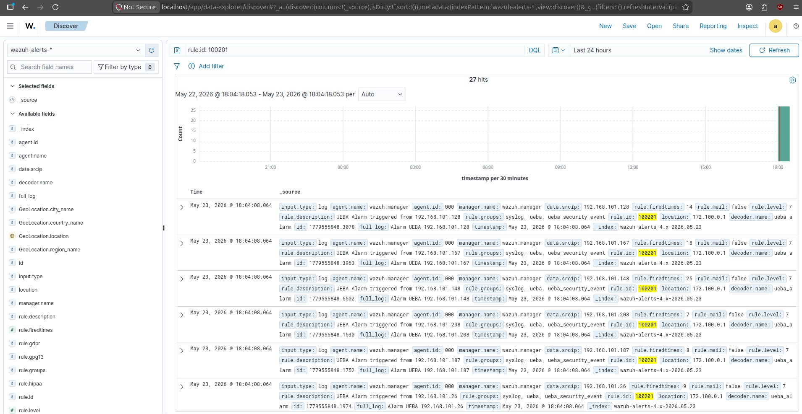

# UEBA Module for SIEM

Project: UEBA Module for SIEM | Universidade de Aveiro

- Diogo Silva       108212 
- Martim Carvalho   108749 
- Dataset: X=1 (108212 + 108749 = 216961 → last digit = **1**)

--- 

# Introduction 

### UEBA (User and Entity Behavior Analytics) 
UEBA is a security approach that builds statistical profiles of normal behaviour from historical data and uses them to flag deviations in new observations. Unlike signature-based detection, which looks for known attack patterns, UEBA detects anomalies that are devices or users behaving in ways inconsistent with their own established baseline. 
This makes it effective against novel threats and insider attacks that leave no known signature.

### GOAL
The goal of this project is to implement a UEBA module. The module reads network flow data, computes per-IP statistical baselines from a training dataset, applies a set of anomaly detection rules to a test dataset, and forwards any flagged alerts to the Wazuh manager via syslog. The full pipeline runs as a single Python script (ueba.py) that produces a consolidated report of anomalous devices and their confidence levels.

### Dataset 
The assigned dataset is ready to explore. It contains two distinct populations: internal clients (192.168.101.x), representing corporate workstations on the internal network, and external clients (188.83.72.x), representing users accessing a corporate server from outside. Both populations include a training file, used to establish normal behaviour, and a test file, where anomalies are detected.


#### AI Prompt
> (All the context above was given to the AI exactly as is just to understand the goal of the project.)
---

# Data Reading & First Observations

## Data Loading
The first step was loading the four JSON files and understanding the structure before writing any detection logic. Each file represents one full day of network flows, with 7 fields per record: src_ip, dst_ip, port, timestamp, up_bytes, down_bytes, and protocol.

Code used:
```python
int_train = pd.read_json(INTERNAL_TRAIN)
int_test  = pd.read_json(INTERNAL_TEST)
ext_train = pd.read_json(EXTERNAL_TRAIN)
ext_test  = pd.read_json(EXTERNAL_TEST)
```
Output received:
```
internal_train : (890749, 7)
internal_test  : (1008425, 7)
external_train : (712488, 7)
external_test  : (681696, 7)
```
We concluded that the test files are larger than the training files in both cases.


## Protocols and Ports
The first thing we explored after loading was what kind of traffic actually exists in the dataset. Grouping by port across the entire internal training file reveals something immediately striking. Concluded that only two ports exist: TCP/443 (HTTPS) and UDP/53 (DNS). No other protocols, no other ports, anywhere in the dataset. The external dataset contains only TCP/443, no DNS traffic at all, consistent with external clients communicating exclusively with the corporate public server.

Code used:
```python
int_train['port'].value_counts()
# 443 (HTTPS)
# 53 (DNS)
```
Every anomaly we detect will be either in HTTPS behaviour or DNS behaviour — there is nothing else to look at. This simplifies the problem significantly and means our detection rules can be precisely targeted at each protocol.


## Internal Network Topology
Inspecting the data, grouping the internal data by destination IP, three internal servers emerge consistently across all 198 clients:

| Role | IP | Port |
|----------|----------|----------|
| DNS Server (primary)| 192.168.101.226 | 53 |
| DNS Server (secondary)| 192.168.101.229 | 53 |
| HTTPS Server | 192.168.101.240 | 443 |

Every one of the 198 internal clients communicates with all three servers during training with no exceptions. This uniformity is itself a baseline: the network behaves like a corporate environment where all machines follow the same configuration. Any device that deviates from this pattern in the test period stands out immediately.

Internal HTTPS traffic (port 443) does not all go to the same place. Grouping training flows by destination IP reveals two distinct populations: traffic to the internal HTTPS server and traffic to external HTTPS servers. 

Code used:
```python
https = int_train[int_train['port'] == 443]
# Identify distinct destination IPs in HTTPS traffic
dst_ips = https['dst_ip'].unique()
internal_dsts = [ip for ip in dst_ips if ip.startswith('192.168.')]
print("Internal HTTPS destinations:", internal_dsts)

" Internal HTTPS destinations: ['192.168.101.240'] "
```

The only internal destination is .240, already known from the network topology. Every other destination IP is a public address, confirming a clean two-population split. Per-client stats were then computed separately for each group:
```python
INTERNAL = '192.168.101.240'
https_int = https[https['dst_ip'] == INTERNAL]
https_ext = https[https['dst_ip'] != INTERNAL]
for label, grp in [('Internal .240', https_int), ('External', https_ext)]:
  per_ip = grp.groupby('src_ip').agg(up=('up_bytes','sum'), down=('down_bytes','sum'))
  per_ip['ratio'] = per_ip['down'] / per_ip['up']
  print(f"{label}: flows={len(grp):,}  up/client={per_ip['up'].mean()/1e6:.1f} MB  ratio={per_ip['ratio'].mean():.4f} ± {per_ip['ratio'].std():.4f}")

" Internal .240:  flows=157,055  up/client=9.0 MB   ratio=9.2255 ± 0.5809 "
" External HTTPS: flows=627,522  up/client=36.1 MB  ratio=9.2460 ± 0.2511 "
```

Both groups were characterised separately:

| Destination            | Flows   | Up (mean/client) | Down (mean/client) | Ratio mean | Ratio std |
|-----------------------|---------|------------------|--------------------|------------|-----------|
| Internal server .240   | 157,055 | 9.0 MB           | 83.2 MB            | 9.2255     | 0.5809    |
| External HTTPS servers | 627,522 | 36.1 MB          | 333.6 MB           | 9.2460     | 0.2511    |

External HTTPS servers account for 80% of all HTTPS flows. 
Both groups maintain nearly identical down/up ratios (~9.23 vs ~9.25) that means the clients download roughly 9.2 bytes for every byte they upload, a heavily download-dominant pattern typical of web browsing.

The std is computed across all 198 clients, it measures how much each individual client's ratio deviates from the group mean. The external HTTPS traffic is tighter (0.25) than traffic to .240 (0.58), confirming the two groups are statistically homogeneous on this dimension. 

This confirms that the ratio is a structural property of the connection type rather than a destination-specific artefact. The combined per-client upload mean of ~45 MB is the direct sum of the two groups (9 MB to .240 + 36 MB to external). This validates using the combined aggregate as the baseline for the HTTPS exfiltration rule, the two populations are statistically homogeneous on the ratio dimension.


## DNS Invariant
The most important single observation in the entire dataset came from inspecting DNS destination IPs. During training, every DNS query from every internal client goes exclusively to .226 or .229, without a single exception across all 198 clients and 890K rows.

Code used:
```python
dns = int_train[int_train['port'] == 53]
internal_servers = set(dns['dst_ip'].unique())
# {'192.168.101.226', '192.168.101.229'}
```
Output received:
```
Internal DNS servers: {'192.168.101.229', '192.168.101.226'}
```
This is an invariant, not a tendency. It directly motivates one of the DNS detection sub-rules: any internal client that sends a DNS query to an IP outside this set during the test period is immediately and unconditionally anomalous. No threshold needed, no baseline this is just a violation of a rule that held perfectly across the entire training dataset.


## External Clients
The external dataset contains clients from the 188.83.72.x subnet connecting to a corporate public server over HTTPS only, no DNS traffic exists in the external files. During training, these clients show a remarkably consistent down/up byte ratio across all 196 devices:

| Metric | Value | 
|----------|----------|
| Mean down/up ratio | 8.50 |
| Std | 0.04 |
| Min | 8.40 |
| Max | 8.61 |

A standard deviation of 0.04 on a ratio of 8.50 means each client downloads almost exactly 8.5× what it uploads, consistently, across every external user. This is the tightest baseline in the entire dataset. It tells us the corporate server behaves very predictably which means any external client that breaks this pattern in the test period is doing something genuinely unusual, not just natural variation. A 3σ window of [8.38, 8.62] is enough to catch real anomalies with very few false positives.

The script also characterised the external inter-flow intervals during baseline computation:

| Metric | Value |
|----------|----------|
| Mean | 807.6 s |
| Median | 104.0 s |
| Std | 11879.4 s |
| p90 | 191.0 s |
| p95 | 3475.0 s |

The gap between median (104s) and mean (807s), and the jump from p90 (191s) to p95 (3,475s), confirms a heavy-tailed distribution, consistent with human web browsing: short active bursts separated by reading pauses, with occasional long overnight idle gaps.


### AI Prompt
> Explore the data given in the dataset1 folder having in mind all the context I gave you before, the script should read the training and then output usefull information that we could use in order to achieve our goal. The idea is to use a pythonScript, that you can have in base the example (sampleScript.py) provided. 

---

# Baseline Computation
Before any detection logic runs, compute_baselines() reads both training files and builds a dictionary of statistical profiles that every rule will consume. This function computes per-IP aggregates (total upload, DNS flow counts, inter-flow intervals, destination countries) and derives the thresholds that define "normal" for each detection rule. Nothing is flagged here. The goal is purely to characterise the training period so the test period can be compared against it.
The function follows a single design principle: compute everything once, return it all as a dictionary. The naive alternative would be to re-read and re-aggregate the training data inside each rule function.

This means scanning ~900k rows five separate times and duplicating the same groupby operations. Instead, compute_baselines() runs exactly once at startup, builds every statistic every rule will ever need, and passes the result as a single dict b. Each rule receives b as its only input and reads from it without modifying it. 

The function itself has no side effects, it prints nothing, flags nothing, and touches no external state. This makes it independently testable and means that replacing the baseline source requires changing only this one function, with zero impact on any detection logic.

### Code Implementation
```python
# HTTPS: group port-443 flows per client, compute PCR per IP
  https = int_train[int_train['port'] == 443]
  https_per_ip = https.groupby('src_ip').agg(total_up=('up_bytes','sum'), total_down=('down_bytes','sum'))
  pcr = (https_per_ip['total_up'] - https_per_ip['total_down']) / (https_per_ip['total_up'] + https_per_ip['total_down'])

# BotNet: sort flows by timestamp per client, diff() gives inter-flow gaps, std() measures regularity
  sorted_train['interval'] = sorted_train.groupby('src_ip')['timestamp'].diff()
  interval_std_per_ip = sorted_train.groupby('src_ip')['interval'].std()

# DNS: count flows per client, extract the set of destination servers
  dns_per_ip = dns.groupby('src_ip').agg(dns_flows=('up_bytes','count'))
  dns_internal_servers = set(dns['dst_ip'].unique())
```
The dictionary compute_baselines() returns one key per metric below. Each rule function receives this dictionary as its only input and reads the relevant keys no rule recomputes or re-reads training data on its own.


## Threshold table
All thresholds are derived dynamically from the training data. The script prints them at startup:
```
HTTPS upload threshold:     116.6 MB         (mean+3σ)
HTTPS PCR threshold:        -0.7918          (mean=-0.8046  std=0.0043)
DNS flow threshold:         1399 flows       (mean+3σ)
BotNet interval p05:        1741.9
External ratio window:      [8.3817, 8.6226]
Geo new-country threshold:  15 countries     (p95 per-IP in training)
Geo min intensity flows:    2 flows          (p05 per-IP-per-country)
```
Each threshold targets a different dimension of behaviour. 
- The HTTPS upload threshold (116.6 MB) defines the maximum total data a normal internal client sends over HTTPS in a day, anything above this suggests bulk data exfiltration. The threshold is derived from combined HTTPS traffic (internal .240 + external servers). The destination split characterised above shows both groups have identical ratios (~9.23), so the combined aggregate is a valid baseline.
- The HTTPS PCR threshold (−0.7918) measures the upload/download balance: PCR (Producer-Consumer Ratio) is defined as (up_bytes − down_bytes) / (up_bytes + down_bytes) and ranges from −1 (pure download) to +1 (pure upload). A normal HTTPS session is download-dominant (the server returns HTML, images, files) so the training mean sits at −0.8046. A device that uploads far more than it downloads pushes PCR toward 0 or positive, which is the fingerprint of data exfiltration even when the total volume is still low. 
- The DNS flow count threshold (1,399 flows) flags clients generating an abnormal number of DNS queries, the primary signal for DNS-based C&C beaconing.
- The BotNet interval std (1,741.9 s) is a floor: any client whose inter-flow timing is more regular than 95% of all normal clients in training is beaconing at a fixed interval, consistent with malware checking in with a C&C server. 
- The external ratio window ([8.3817, 8.6226]) defines the expected down/up range for external clients. Any external client outside this window is interacting with the corporate server in an anomalous way.


## The 3σ Rule
The choice of 3σ as the threshold is an industry standard in statistical anomaly detection. Under a normal distribution, 99.9% of observations fall within 3 standard deviations of the mean, meaning only 0.1% of legitimate traffic would be flagged as anomalous by chance.

Applied consistently across all volume-based rules, it means the thresholds adapt automatically to the dataset: a network with higher baseline DNS traffic will produce a higher DNS threshold, and a network with tighter HTTPS upload patterns will produce a lower upload threshold. No manual tuning required.
To make this concrete for this dataset: with 198 internal clients, a 0.1% false-positive rate per rule means roughly 0.2 false positives per rule per day in the worst case, easily manageable for a security analyst.

The alternatives were evaluated and rejected: 
- 2σ (97.7% coverage) would produce approximately 4 false positives per rule per day, creating a noise floor that drowns real signals; 
- 4σ (99.9937% coverage) would set the bar so high that moderate exfiltration (a device uploading 200 MB when the mean is 45 MB) would go undetected.

## Exception
The BotNet rule cannot use "mean − 3σ" because the inter-flow interval standard deviation distribution in training is heavily right-skewed (most clients have moderate regularity, but a few have very high interval variability, pulling the mean up).

The training values are: mean = 8,350 s, std = 6,668 s. Applying "mean − 3σ" gives 8,350 − 3 × 6,668 = −11,654 s; a negative threshold, which is mathematically meaningless for a standard deviation. 
Instead, we use the 5th percentile (p05 = 1,741.9 s) of the training distribution as the floor. This represents the lower boundary of normal behaviour empirically observed in training. Any client with an inter-flow interval std below this value is more regular than 95% of all normal clients, making it a strong candidate for beaconing behaviour.

## Country Distribution
As part of the baseline computation, every internal client's HTTPS traffic was mapped to destination countries using a GeoIP database. Across all 198 clients and the full training period, the network contacted 36 unique countries. The top 5 alone account for 94.8% of all flows, showing a heavily concentrated geographic footprint:

| Country | Flows | % of Total | 
|----------|----------| ---------|
| PT | 234442 | 37.4% |
| US | 164761 | 26.3% |
| CA | 93719 | 14.9% |
| FR | 64307 | 10.2% |
| NL | 37617 | 6.0% |
| (others) | 32676 | 5.2% |

These 36 countries define the known geographic footprint of this network, any country contacted in the test period that never appeared in training is an immediate network-level anomaly, regardless of which client triggered it.


### AI Prompt
> Now we need to do a compute_baselines() function to help us defining the baselines. The idea is to compute the necessary statistics and thresholds that will be used by the detection rules. You can use the information you got from the data exploration phase and the list with all rules and justification for detection, to decide which statistics are relevant for each rule. The idea is to find the "normal" tresholds for each rule based on the training data, so that when we apply the rules to the test data, we can flag any deviations from these baselines as anomalies.

---

# Rule Implementation
With the baselines established, the next step was implementing the detection rules. 
Each rule targets a specific type of anomalous behaviour and operates independently, consuming the baseline dictionary computed in the previous step. 
Each rule follows the same pipeline: statistical thresholds are derived exclusively from the training dataset and then applied to the test dataset, which represents a separate day where anomalous behaviour may be present. 
The training data never sees the test data, and the test data never influences the thresholds. 

This strict separation is what gives the detection statistical validity: the baselines describe what normal looks like before any anomaly occurs, and the rules measure how far the test behaviour deviates from that established normal.
The rules were designed to be complementary rather than redundant: some catch high-volume bulk attacks, others catch low-and-slow patterns that volume alone would miss entirely. 
For each rule, the process followed the same structure: define the metric, compute the threshold from training, apply it to the test data, and examine what gets flagged. 

In several cases the first approach produced too many false positives or broke down statistically, requiring iteration before arriving at a clean result.

## External Anomaly Detection
### What to look for
The external anomaly rule targets clients from the 188.83.72.x subnet accessing the corporate server in an unusual way. 
The key insight here is that the relevant signal is not the amount of traffic, but the ratio between downloaded and uploaded bytes. 
During training, every external client consistently downloads roughly 8.5× what it uploads: a tight, stable pattern with a standard deviation of just 0.04. 

This makes the ratio the most discriminating metric in the entire dataset: a client whose ratio breaks this pattern is interacting with the server in a fundamentally different way than normal, regardless of total volume. 
A 3σ window of [8.3817, 8.6226] is sufficient to flag real anomalies with minimal false positives.
### Code Implementation
Code used:
```python
low = mean - SIGMA * std  # 8.3817
high = mean + SIGMA * std # 8.6226

flagged = per_ip[(per_ip['ratio'] < low) | (per_ip['ratio'] > high)]
```
We compute the ratio for each external client in the test period and flag anyone outside the 3σ window. Below the lower bound means the client is uploading proportionally more than expected. Above the upper bound means it is downloading proportionally more than expected.
### Results
The rule flagged 5 external IPs, which naturally split into two distinct behavioural groups:
```
[ALERT] 188.83.72.61   ratio=8.232  deviation=6.7σ
[ALERT] 188.83.72.64   ratio=8.338  deviation=4.1σ
[ALERT] 188.83.72.174  ratio=8.334  deviation=4.2σ
[ALERT] 188.83.72.182  ratio=8.661  deviation=4.0σ
[ALERT] 188.83.72.210  ratio=8.644  deviation=3.5σ
```
The results revealed two groups: 
- The first group (.61, .64, .174) sit below the lower bound. Their ratio is lower than normal, meaning they upload proportionally more than a legitimate client would. This is consistent with a compromised account being used to push data toward the corporate server, or with reversed exfiltration where data is staged on the server from outside. 
- The second group (.182, .210) sit above the upper bound, downloading more than expected relative to what they upload, consistent with bulk data retrieval or unusual large-object access. These are two different threat models, but the same symmetric rule catches both because both break the tight ratio invariant in opposite directions.

The 188.83.72.61 at 6.7σ is the most extreme anomaly in the entire external dataset. 

A second detection signal was implemented and evaluated before finalising this rule. Since compute_baselines() already computes the per-client inter-flow interval distribution for characterisation, the p05 of per-client interval standard deviation (2,132.6 s) was added as a second threshold alongside the ratio: any external client whose inter-flow interval std fell below this floor (more regular than 95% of all training clients) would also be flagged, using OR logic. 

Applied to the test data, this produced 25 flagged IPs instead of 5. The additional 20 were triggered exclusively by the interval signal with completely normal ratios.
The problem is statistical: a p05 floor applied to 196 test clients produces approximately 10 false positives by chance alone, and the borderline interval-only hits (iv_std ranging 1,839–2,130 s against a floor of 2,132.6 s) are too marginal to be convincing detections. 

The interval signal was removed and the floor retained as characterisation output only.


## Internal Anomaly Detection (HTTPS Exfiltration)
### What to look for
The HTTPS exfiltration rule targets internal clients sending an abnormal amount of data outbound over HTTPS. 
The first instinct is to flag by volume: any client uploading more than mean + 3σ (116.6 MB) in the test period is suspicious. 

However, volume alone has a blind spot: a device that exfiltrates data slowly and steadily, keeping its total upload below the threshold, would go completely undetected. 

To catch this pattern, we added a second signal: the PCR (Producer-Consumer Ratio), which measures the upload/download balance independently of total volume. 
The rule flags any client that triggers either condition, making it sensitive to both bulk single-shot dumps and low-and-slow exfiltration.
### Code Implementation
Explaining the PCR:
```python
PCR = (up_bytes - down_bytes) / (up_bytes + down_bytes)
```
The value ranges from −1 (pure download) to +1 (pure upload). 
A normal HTTPS session is download-dominant (the client sends a request and the server returns HTML, images, or files) so the training mean sits at −0.8046. 
A device that is exfiltrating data sends large uploads and receives only small acknowledgements in return, pushing PCR toward 0 or positive. 

The 3σ threshold is −0.7918: any client above this value is uploading disproportionately relative to what it downloads, regardless of total volume.

```python
flagged_vol = per_ip['total_up'] > vol_threshold  # > 116.6 MB
flagged_pcr = per_ip['pcr']      > pcr_threshold  # > -0.7918
flagged     = per_ip[flagged_vol | flagged_pcr]
```
The OR logic is the key design decision: a client only needs to break one of the two conditions to be flagged. This ensures neither pattern escapes detection.

One metric was tested and removed before arriving at this design: the raw down/up ratio (total_down / total_up), which is the same metric used for external clients. 

An equivalent internal ratio was computed in baselines and applied to the test data. It turned out to be algebraically equivalent to PCR via the identity PCR = (1 − ratio) / (1 + ratio), producing a Pearson correlation of −0.9992 between the two series across all training clients.

Applied to the test set, both metrics flagged the identical set of IPs: zero additional detections from the ratio. PCR was kept as the bounded, normalised [−1, +1] formulation from the literature.
### Results
The rule flagged 10 internal IPs:
```
[ALERT] 192.168.101.187  upload=7586.3 MB  deviation=316.4σ  triggered_by=volume+PCR
[ALERT] 192.168.101.14   upload=5352.1 MB  deviation=222.6σ  triggered_by=volume+PCR
[ALERT] 192.168.101.208  upload=4402.0 MB  deviation=182.8σ  triggered_by=volume+PCR
[ALERT] 192.168.101.26   upload=259.2 MB   deviation=9.0σ    triggered_by=volume+PCR
[ALERT] 192.168.101.197  upload=138.3 MB   deviation=3.9σ    triggered_by=volume+PCR
[ALERT] 192.168.101.207  upload=119.0 MB   deviation=3.1σ    triggered_by=volume
[ALERT] 192.168.101.188  upload=39.4 MB    deviation=-0.2σ   triggered_by=PCR
[ALERT] 192.168.101.78   upload=6.9 MB     deviation=-1.6σ   triggered_by=PCR
[ALERT] 192.168.101.128  upload=4.7 MB     deviation=-1.7σ   triggered_by=PCR
[ALERT] 192.168.101.117  upload=1.2 MB     deviation=-1.8σ   triggered_by=PCR
```
The first five devices were caught by both signals: their uploads range from 138 MB to 7.6 GB, orders of magnitude above the 116.6 MB threshold.
The most interesting cases are the last four: flagged by PCR alone, with upload volumes below the training mean of 45 MB. 

A volume-only rule would have missed all of them entirely. and the .117 is the clearest example: it uploaded only 1.2 MB that day and received back only ~9.9 MB in return. 

This pushed PCR above the threshold: at −0.783 versus the training mean of −0.8046, it was uploading proportionally more relative to its downloads than any legitimate client in training, despite the low absolute volume. This is the low-and-slow fingerprint: a device whose upload size is invisible to volume detection but whose upload/download imbalance is fully exposed by PCR.

The two most borderline detections are .78 and .128, sitting at 3.40σ and 3.86σ from the PCR mean respectively. Both also have very low absolute upload volumes (6.9 MB and 4.7 MB). For a client with little overall HTTPS activity, the PCR estimate is computed over fewer flows, giving natural variance more room to push the metric across the threshold.

At 3.40σ, the expected probability of a legitimate client exceeding the threshold is approximately 0.034%: about 0.07 false positives across 198 clients. These two are retained under the consistent 3σ rule but are the lowest-confidence detections in this rule, and would be the first to dismiss under analyst review. 
.117 and .188 are more convincing: .117 sits at 5.0σ, a clean separation even accounting for estimation noise; .188's PCR of −0.583 is 51σ from the training mean, unambiguously anomalous.


## GeoDestination Anomaly Detection
### What to look for
The geo destination rule targets internal clients contacting countries that are anomalous either at the network level or at the individual device level. The first approach was straightforward: flag any internal client that contacts a country in the test period that it never contacted during training. 

The result was immediate and catastrophic: 163 of 198 clients flagged, an 82% false positive rate. The reason is CDN rotation: large content delivery networks distribute their infrastructure globally and rotate IP addresses across countries regularly, meaning a legitimate user visiting the same website on two different days may hit servers in different countries each time. 
A naive per-IP new-country rule is completely blind to this and produces noise, not signal.
### Code Implementation
To solve the false positive problem, we replaced the naive approach with a two-tier detection strategy:
- Tier 1 (global): flag any client reaching a country that no client in the entire network contacted during training. Any access to these is immediately anomalous at the network level (not just new to the individual device, but new to the whole organisation).
- Tier 2 (per-IP): flag clients that contact 15 or more new-to-them countries in the test period. The threshold is data-derived: p95 of per-IP unique country counts in training equals 15, meaning any device reaching more new countries than 95% of all clients ever contacted during training is flagged. CDN rotation typically adds 1–3 new countries naturally.
```python
new_to_network = test_countries - global_train_countries  # Tier 1
new_to_ip      = test_countries - known_countries         # Tier 2

if new_to_network and flows_to_new >= MIN_INTENSITY_FLOWS:
      # fire Tier 1 alert
if len(new_to_ip) >= 15 and flows_to_new >= MIN_INTENSITY_FLOWS:
      # fire Tier 2 alert
```
The set difference operation is the core of both tiers: subtracting the known country sets from the observed ones leaves only the genuinely new destinations. 
The MIN_INTENSITY_FLOWS = 2 filter is data-derived from the p05 of per-IP-per-country flow counts in training. Any new-country access with fewer flows than this floor is CDN noise.

A third detection dimension was implemented and removed before finalising this rule: ASN (Autonomous System Number) detection. The hypothesis was that a compromised device contacting a new cloud provider or hosting company is suspicious even if the destination country is already known, a device that always used AWS might suddenly start reaching a Russian hosting ASN, which a country-only rule would miss if Russia was already in the training set. ASN lookups were implemented alongside country lookups using a separate GeoIP database. Applied to the test data, the set of IPs flagged by new-ASN detection overlapped exactly with those flagged by new-country detection. The ASN lookups added approximately 2.2 seconds of overhead per run with zero additional detections, and were removed.
### Results
The two-tier approach with the intensity filter produced 6 unique flagged IPs across 9 alerts (some IPs triggered both tiers):
```
[ALERT] 192.168.101.125  +11 new to network, +25 new to IP  (incl. RU, IR, UA)
[ALERT] 192.168.101.36   +17 new to network, +29 new to IP  (incl. RU, IR, IQ, KZ)
[ALERT] 192.168.101.72   +15 new to network, +30 new to IP  (incl. RU, IR, UA)
[ALERT] 192.168.101.167  +1 new to network  (BE only, 9 flows)
[ALERT] 192.168.101.175  +1 new to network  (BE only, 4 flows)
[ALERT] 192.168.101.189  +1 new to network  (BE only, 2 flows)
```
The .125, .36, and .72 are the highest confidence cases: they triggered both tiers, reaching countries the entire network had never contacted in training.

The three most borderline results are .167, .175, and .189: each triggered only Tier 1 with a single new country (Belgium), with 9, 4, and 2 flows respectively. A single new-country contact with very few flows sits at the edge of what can be distinguished from a CDN edge rotation. All three survived the data-derived intensity floor (≥ 2 flows, p05 of training) and were retained to avoid silently discarding a genuine signal, but they warrant the most analyst scrutiny of any detection in the dataset.


## DNS Anomaly Detection
### What to look for
The DNS anomaly rule targets internal clients exhibiting abnormal DNS behaviour, using two independent sub-rules that catch different aspects of the same threat category.

- DNS-1 (Volume) flags any client whose total DNS flow count exceeds mean + 3σ (1,399 flows): an extreme query rate is the primary signal for both DNS-based C&C beaconing and DNS tunneling. 
- DNS-2 (Public server) flags any client that sends a DNS query to a server outside .226 and .229. Since this invariant held perfectly across all 198 clients during training, any violation is unconditionally anomalous and requires no statistical threshold. 

The two sub-rules are complementary: DNS-1 catches volume-based abuse through the internal resolvers, DNS-2 catches any attempt to bypass them entirely:
```python
# DNS-1: volume anomaly
  threshold      = mean + SIGMA * std          # 1,399 flows
  volume_flagged = dns_count[dns_count > threshold]
# DNS-2: public DNS server (binary invariant)
  public_dns = dns_test[~dns_test['dst_ip'].isin(internal_servers)]
```
### C&C Beaconing vs DNS Exfiltration
Before presenting the results, it is important to distinguish between two different DNS-based attack patterns, since they look different in the data and have different implications. 

- DNS data exfiltration encodes stolen data inside DNS query subdomains: the queries are bursty, aperiodic, and contain long high-entropy subdomain labels. 
- DNS C&C beaconing uses DNS queries as a heartbeat mechanism: a malware implant checks in with its C&C server at a fixed clock-driven interval, producing a very regular, high-volume query pattern with normal-looking short domain names.

| Aspect | C&C Beaconing | DNS Exfiltration |
|----------|----------|----------|
| Pattern | Fixed periodic intervals | Bursty, aperiodic |
| Query content | Short, normal-looking | Long high-entropy subdomains |
| Volume | Extreme query count | Moderate count, large payload |
| Interval | Exact, clock-driven | Irregular |

What we detected in this dataset is C&C beaconing, not exfiltration: the exact 5.0s median interval across all flagged devices is the signature of a malware timer. Actual data exfiltration in this dataset happens over HTTPS, as seen in the previous rule.

We initially considered flagging DNS exfiltration by FQDN entropy. However, the dataset does not include subdomain fields, only destination IPs, making entropy analysis impossible with the available data. 

A second approach was also attempted before arriving at the final: flagging anomalous DNS behaviour by per-query payload size (up_bytes). The hypothesis was that DNS exfiltration encodes data inside subdomain labels, making each query packet larger than a normal lookup. The training baseline for DNS query size is tight, applied to the test data, not a single IP exceeded this threshold. The beaconing pattern in this dataset uses fixed-size queries carrying only a short beacon identifier, not encoded data, so the payload size is indistinguishable from normal traffic. This sub-rule was computed, tested, and dropped, it has zero discrimination power for this dataset.
### Results
DNS-1 flagged 5 internal IPs. DNS-2 produced zero alerts — no client in the test period sent DNS queries to a public server:
```
[ALERT] 192.168.101.41   flows=39,493  median interval=5.0s  increase=129×
[ALERT] 192.168.101.23   flows=8,651   median interval=5.0s  increase=8.6×
[ALERT] 192.168.101.201  flows=2,941   median interval=5.0s  increase=15.7×
[ALERT] 192.168.101.148  flows=1,661   median interval=5.0s  increase=4.8×
[ALERT] 192.168.101.207  flows=1,418   median interval=5.0s  increase=3.4×
```
Every flagged device shows an exact 5.0s median interval between DNS queries: a clock-driven malware timer firing consistently throughout the day. 
The .41 is the most extreme case at 39,493 flows, 129× its own training baseline, with queries concentrated almost entirely on the two internal resolvers. 

The zero result for DNS-2 is not a failure of the rule, it is explained by the beaconing pattern itself. The malware routes its C&C traffic through the internal DNS resolvers, which forward the queries upstream to the external C2 server. The infected devices never contact public DNS directly, which is why DNS-2 sees nothing. Both results together paint a consistent picture.


## BotNet Beacon Detection
### What to look for
The BotNet beaconing rule targets internal clients whose network traffic follows an unusually regular timing pattern. A botnet implant checks in with its C&C server at a fixed interval producing a very low standard deviation in inter-flow timestamps compared to legitimate users, whose traffic is naturally irregular. 

The detection metric is therefore the standard deviation of inter-flow intervals per client: a suspiciously low value means the device is firing traffic at a clockwork rate.
The first approach was to apply the standard mean (3σ threshold), flagging any client below this floor. This immediately broke down, the inter-flow interval std distribution in training is heavily right-skewed, with a mean of 8,350s and a std of 6,668s. Applying mean − 3σ gives:
``` 8,350 − 3 × 6,668 = −11,654 s ```
A negative standard deviation is mathematically meaningless. No threshold can be set this way on a right-skewed distribution.
### Code Implementation
The solution was to use the 5th percentile (p05 = 1,741.9s) of the training distribution as the threshold floor. This represents the empirical lower boundary of normal behaviour: any client in the test period with an interval std below this value is more regular than 95% of all legitimate clients in training, a strong signal of automated clock-driven behaviour.

An alternative approach is the Coefficient of Variation (CV), defined as std/mean, with CV ≤ 0.2. We evaluated this but rejected it: when computed on the training data, the CV ranges for normal clients (3.93–25.52) and the confirmed beaconing devices (3.7–16.6) overlap almost completely. There is no clean separation point, making CV useless as a discriminator for this dataset. The p05 interval std produces a clear boundary with no overlap.
```python
threshold = baselines['interval_std_p05']    # 1,741.9s — p05 of training

overall_std = test_sorted.groupby('src_ip')['interval'].std()
flagged_ips = overall_std[overall_std < threshold]
```
### Results
The rule flagged 8 internal IPs, which split into two distinct beaconing channels:
```
[ALERT] 192.168.101.23   interval std=595s   (0.34× floor)  DNS  median=5.0s
[ALERT] 192.168.101.117  interval std=938s   (0.54× floor)  HTTPS median=100.0s
[ALERT] 192.168.101.41   interval std=1,185s (0.68× floor)  DNS  median=5.0s
[ALERT] 192.168.101.32   interval std=1,242s (0.71× floor)  mixed HTTPS=99s DNS=5s
[ALERT] 192.168.101.72   interval std=1,403s (0.81× floor)  HTTPS median=102.0s
[ALERT] 192.168.101.201  interval std=1,598s (0.92× floor)  mixed HTTPS=103s DNS=5s
[ALERT] 192.168.101.160  interval std=1,667s (0.96× floor)  mixed HTTPS=104s DNS=5s
[ALERT] 192.168.101.188  interval std=1,697s (0.97× floor)  mixed HTTPS=103s DNS=5s
```
The 8 devices fall into two beaconing channels. 
- The first .23 and .41 beacon exclusively via DNS at a 5.0s interval, consistent with what DNS-1 already identified. 
- The second and more striking group beacons via HTTPS at intervals clustering tightly between 99 and 104 seconds across six independent devices. This is not coincidence, the six infected machines maintaining the same ~100s check-in interval is the fingerprint of a single malware family sharing the same hardcoded C2 timer.

The 192.168.101.148 was flagged by DNS-1 with 1,661 flows at an exact 5.0s median interval (the same C&C pattern as every confirmed beacon in this dataset).
However, it is not flagged by this rule. The reason is that .148 also has highly irregular HTTPS traffic with long idle gaps throughout the day. When inter-flow intervals are computed across all its traffic combined (both DNS and HTTPS) the overall interval std is 7,259s, far above the p05 floor of 1,742s. The irregular HTTPS behaviour completely drowns out the tight DNS beaconing signal in the combined calculation.

This is a real limitation of the combined-channel approach, but it also demonstrates exactly why the two rules are complementary rather than redundant. 
- Step 5 catches .148 through DNS volume. 
- Step 6 catches the devices whose beaconing dominates their overall traffic pattern. 

Together they cover both cases, removing either rule would leave a gap.


---

# Final Results 
## Final output
Running the full detection pipeline against the test dataset produced 27 unique anomalous IPs: 22 internal clients (192.168.101.x) and 5 external clients (188.83.72.x). Each flagged IP was assigned a confidence level based on how many independent rules triggered it: HIGH when two or more rules agree on the same device, MEDIUM when only one rule fires. 

The two-level scheme is not arbitrary:
- when a single rule flags a device, there is always a small residual probability of a false positive; 
- when two completely independent detection methods both flag the same IP on the same day, the probability of a coincidental double false positive is the product of the individual rates, dropping to approximately 0.0001% per device.

The 7 HIGH confidence IPs are therefore treated as confirmed compromised devices. The 20 MEDIUM confidence IPs are genuine anomalies that warrant investigation but cannot be confirmed by corroboration alone.
```
 Total Unique Anomalous IPs: 27
    - Internal (192.168.101.x): 22
    - External (188.83.72.x): 5

  -- HIGH confidence (2+ independent rules) --
  [HIGH  ] 192.168.101.23   →  detect_dns_anomalies | detect_botnet_beaconing
  [HIGH  ] 192.168.101.41   →  detect_dns_anomalies | detect_botnet_beaconing
  [HIGH  ] 192.168.101.201  →  detect_dns_anomalies | detect_botnet_beaconing
  [HIGH  ] 192.168.101.207  →  detect_https_exfiltration | detect_dns_anomalies
  [HIGH  ] 192.168.101.117  →  detect_https_exfiltration | detect_botnet_beaconing
  [HIGH  ] 192.168.101.188  →  detect_https_exfiltration | detect_botnet_beaconing
  [HIGH  ] 192.168.101.72   →  detect_new_geo_destinations | detect_botnet_beaconing

  -- MEDIUM confidence (single rule) --
  [MEDIUM] 192.168.101.187  →  detect_https_exfiltration
  [MEDIUM] 192.168.101.14   →  detect_https_exfiltration
  [MEDIUM] 192.168.101.208  →  detect_https_exfiltration
  [MEDIUM] 192.168.101.26   →  detect_https_exfiltration
  [MEDIUM] 192.168.101.197  →  detect_https_exfiltration
  [MEDIUM] 192.168.101.78   →  detect_https_exfiltration
  [MEDIUM] 192.168.101.128  →  detect_https_exfiltration
  [MEDIUM] 192.168.101.148  →  detect_dns_anomalies
  [MEDIUM] 192.168.101.32   →  detect_botnet_beaconing
  [MEDIUM] 192.168.101.160  →  detect_botnet_beaconing
  [MEDIUM] 192.168.101.125  →  detect_new_geo_destinations
  [MEDIUM] 192.168.101.36   →  detect_new_geo_destinations
  [MEDIUM] 192.168.101.167  →  detect_new_geo_destinations
  [MEDIUM] 192.168.101.175  →  detect_new_geo_destinations
  [MEDIUM] 192.168.101.189  →  detect_new_geo_destinations
  [MEDIUM] 188.83.72.61     →  detect_external_anomalies
  [MEDIUM] 188.83.72.64     →  detect_external_anomalies
  [MEDIUM] 188.83.72.174    →  detect_external_anomalies
  [MEDIUM] 188.83.72.182    →  detect_external_anomalies
  [MEDIUM] 188.83.72.210    →  detect_external_anomalies
```

## False Negative Check
A false negative is a compromised device that the pipeline did not flag, the most dangerous failure mode in a detection system. To verify that no real anomaly was silently missed, we independently recomputed the highest metric value observed among all unflagged devices for each volume-based rule, and compared it against the threshold. If any unflagged device sits suspiciously close to the boundary, the threshold may be too conservative.

| Rule | Highest unflagged value | Threshold | Gap |
|----------|-----------------------|-----------|-----|
| HTTPS upload | 105.2 MB | 116.6 MB | 11.4 MB |
| DNS flows | 1307 flows | 1399 flows | 92 flows |
| BotNet interval std | 1758.4 s | 1741.9 s | 16.5 s above floor |

After analyzing the results, no false negatives were found. Every unflagged device sits comfortably below its threshold with a meaningful gap.

 The BotNet row deserves a specific note: the highest unflagged interval std is 1,758.4 s, sitting just 16.5 s above the p05 floor of 1,741.9 s. This is the closest any unflagged device gets to a threshold anywhere in the results, but it is still cleanly above the floor.

## Highest Confidence Detections
The 7 HIGH confidence devices are those flagged by two or more completely independent detection rules. Independence here is not just statistical, each rule operates on a different metric, a different protocol, and a different aspect of behaviour. 

- The BotNet rule measures traffic timing regularity across all flows. 
- The DNS rule measures query volume and destination. 
- The HTTPS rule measures upload volume and upload/download asymmetry. 
- The Geo rule measures destination countries. 

None of these share an input or a computation path. When two of them agree on the same device, they are making the same accusation from entirely different angles.

| IP | Rules Triggered | Interpretation |
|----------|-----------------|----------------|
| 192.168.101.41 | DNS Volume + BotNet | 39,493 DNS queries at an exact 5.0 s interval — extreme C2 beaconing via internal DNS relay, confirmed by both volume and timing |
| 192.168.101.23 | DNS Volume + BotNet | 8,651 DNS queries at 5.0 s — same C2 pattern, smaller scale, same malware family |
| 192.168.101.201 | DNS Volume + BotNet | DNS beaconing at 5.0 s plus HTTPS activity at ~103 s — dual-channel implant using both protocols |
| 192.168.101.207 | HTTPS Exfiltration + DNS Anomalies | 119 MB uploaded over HTTPS while simultaneously generating 1,418 DNS queries — active exfiltration running alongside a DNS beacon |
| 192.168.101.72 | New Geo + BotNet | Contacted 30 new countries including RU, IR, UA while maintaining a regular ~102 s HTTPS beacon — C2 communication combined with broad new infrastructure reach |
| 192.168.101.117 | HTTPS PCR + BotNet | Only 1.2 MB uploaded but PCR = −0.783 — low-and-slow exfiltration with an HTTPS beacon at 100 s intervals, the most covert device in the dataset |
| 192.168.101.188 | HTTPS PCR + BotNet | 39.4 MB uploaded with PCR = −0.583 plus regular ~103 s beacon — moderate-volume exfiltration with a persistent C2 check-in |

The 192.168.101.117 is the most notable entry: its upload volume of 1.2 MB is well below the training mean of 45 MB, meaning a volume-only rule would have given it a clean bill of health. It was caught exclusively by PCR and confirmed by BotNet — two independent signals that together make its compromise unambiguous. This is the strongest validation in the entire results for why the dual-signal HTTPS rule was necessary.


## Attack Patterns
Grouping the 27 flagged devices by behaviour reveals eight distinct attack patterns active in the test period:

| Pattern | Devices | Description |
|----------|---------|-------------|
| Mass HTTPS Exfiltration | .187, .14, .208 | 4.4-7.6 GB uploaded in a single day, 182-316σ above baseline - bulk data dumps, likely automated |
| Moderate HTTPS Exfiltration | .197, .26 | 138–259 MB uploaded — above the 116.6 MB threshold by 3.9–9σ, triggered by both volume and PCR |
| Low-and-Slow Exfiltration | .117, .78, .128, .188 | Upload volumes below the training mean, caught only by PCR — covert, sustained data leakage |
| DNS C&C Beaconing | .41, .23, .201, .148 | Exact 5.0s query interval to internal resolvers - malware heartbeat routed through internal DNS relay |
| HTTPS C&C Beaconing | .117, .72, .32, .160, .188, .201 | Check-in intervals clustering between 99-104s across six independent devices - single malware family, shared hardcoded timer |
| Dual-Channel implant | .201, .207 | Simultaneous DNS beaconing and HTTPS activity - two independent C&C channels or exfiltration running alongside beaconing |
| Geo Expansion | .125, .36, .167, .175, .189 | Devices that contacted countries new to the entire network — .125 and .36 triggered both tiers with 25–29 new countries including RU, IR, IQ, KZ; .167, .175, and .189 triggered Tier 1 only with a single new country (Belgium), with 9, 4, and 2 flows respectively — the most borderline detections in the dataset |
| External upload anomaly | .61, .64, .174, .182, .210 | External clients breaking the tight 8.50 ratio invariant - three uploading more than normal, two downloading more than normal |


---

# SIEM Integration

## Sending the Alert
Once all anomalous IPs are identified, each one is reported to the Wazuh manager by sending a UDP syslog message in the format "Alarm UEBA <ip>" — exactly as prescribed by the spec. The implementation uses a raw Python socket, requiring no external tool or Wazuh agent on the monitoring machine:
```python
def send_syslog_alert(ip: str) -> None:
  with socket.socket(socket.AF_INET, socket.SOCK_DGRAM) as sock:
    sock.sendto(f"Alarm UEBA {ip}".encode(), (WAZUH_IP, WAZUH_PORT))
```
One packet is sent per flagged IP. All 27 were successfully delivered to 172.100.0.12:514:
```
[*] Sending UEBA alerts to Wazuh (172.100.0.12:514)...
      → Alarm UEBA 192.168.101.23
      → Alarm UEBA 192.168.101.41
      → Alarm UEBA 192.168.101.72
      ...
      → Alarm UEBA 192.168.101.160   (27 total)
```


## Decoder and Rule 
For Wazuh to interpret the incoming syslog message, a custom decoder and rule were added inside the wazuh.manager container.

The decoder (/var/ossec/etc/decoders/local_decoder.xml) identifies the message by its prefix and extracts the flagged IP into the srcip field:
```xml
<decoder name="ueba_alarm">
    <prematch>Alarm UEBA</prematch>
  </decoder>

  <decoder name="ueba_alarm_fields">
    <parent>ueba_alarm</parent>
    <regex offset="after_parent">(\d+\.\d+\.\d+\.\d+)</regex>
    <order>srcip</order>
  </decoder>
```

  The rule (/var/ossec/etc/rules/local_rules.xml) fires a level 7 alert every time this decoder matches:
```xml
  <group name="syslog,ueba,">
    <rule id="100201" level="7">
      <decoded_as>ueba_alarm</decoded_as>
      <description>UEBA Alarm triggered from $(srcip)</description>
      <group>ueba_security_event</group>
    </rule>
  </group>
```
In Wazuh's rule classification, level 7 corresponds to "bad word matching" (a keyword or pattern match on log content).
It sits above the default log threshold of level 3, ensuring the alert is generated, indexed, and visible in the Security Events dashboard without requiring a severity escalation to a higher level. 
Rule ID 100201 is the one used having in mind the Guides.


## Dashboard 
With the Wazuh stack running and all 27 syslog packets delivered, navigating to Security Events and applying the DQL filter rule.id: 100201 shows one event per flagged IP: 27 hits, each carrying data.srcip with the anomalous device's address, rule.level = 7, and decoder.name = ueba_alarm.


## Conclusion
This integration pattern, demonstrates that any monitoring system can feed alerts into a SIEM without requiring a Wazuh agent on the monitoring machine. The Wazuh manager acts as a centralised collection point: once the decoder and rule are in place, any source that speaks syslog can contribute structured, queryable events to the same dashboard used for all other security monitoring.

One limitation worth noting: UDP syslog provides no delivery acknowledgement. A packet dropped under network congestion is silently lost with no retry. 
For a production deployment where missing an alert is unacceptable, TCP syslog or a Wazuh agent on the monitoring host would be the preferred approach.
